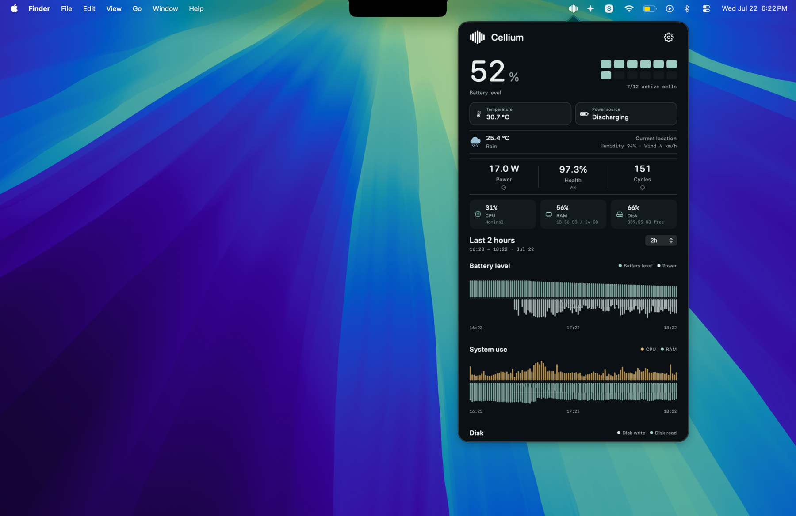

<div align="center">
  

  <h1>Cellium</h1>

  <p><strong>See why your Mac battery changes, understand what consumes it, and decide what to do next.</strong></p>

  <p>
    <a href="https://github.com/Obed0101/Cellium/releases/latest">Download the latest release</a>
    ·
    <a href="https://github.com/Obed0101/Cellium/actions/workflows/ci.yml">CI</a>
    ·
    <a href="LICENSE">MIT license</a>
  </p>
</div>

Cellium is a native macOS menu bar app for people who want useful battery and power data without a cloud dashboard. It reads the signals macOS actually exposes, keeps history locally, and turns them into a calm view of battery state, power draw, system load and usage patterns.

## What Cellium does

Cellium answers the practical battery questions first:

- **What is happening now?** Battery level, charging state, power source, temperature, health and cycle count.
- **What changed?** Local history for battery level, power, CPU, memory, disk activity and temperature.
- **What is consuming resources?** The apps and processes currently associated with the highest CPU/RAM and estimated battery impact.
- **Is the battery behaving normally?** Deterministic alerts and local learning help surface rapid discharge, heat, high memory use and unusual patterns.
- **Can I inspect the evidence?** Yes. Data is stored locally in SQLite and unavailable measurements stay unavailable instead of becoming invented precision.

## See Cellium in action

<p align="center">
  
</p>

The dashboard is designed to make the important state visible immediately: battery percentage, active cells, temperature, power source, health, cycles, system load and historical trends.

## Smart by design

Cellium is intentionally **local-first and evidence-driven**:

- No account, cloud sync or analytics is required for normal monitoring.
- Battery health, battery level, cycles and battery wear are treated as different signals.
- Estimates are labeled as estimates; Cellium does not claim exact per-process wattage when macOS cannot provide it.
- Read-only adapters are used. Cellium does not write to the SMC, install kernel extensions or require a privileged helper.
- Optional integrations remain user-controlled and feature-gated.

## Current capabilities

- Native macOS menu bar dashboard built with Swift and SwiftUI/AppKit.
- Battery percentage, charging state, power source, temperature, health and cycle count.
- Thermal-state and Low Power Mode signals where macOS exposes them.
- Local SQLite persistence for battery, power and system history.
- Historical charts with selectable time windows and hover details.
- Process/app impact summaries using CPU, memory and estimated battery-discharge contribution.
- Configurable sampling, deterministic learning and macOS alerts for important conditions.
- A conservative data model that reports quality and missing readings honestly.

Cellium is still evolving. Exact per-process wattage, Intel compatibility, charge automation, WeatherKit and notarized distribution are not promises of the current release.

## Product surfaces

The product is being expanded around a few focused screens instead of a noisy dashboard:

- **Dashboard** — current battery state, system status and history.
- **Alerts** — persistent battery/process conditions with optional macOS notifications.
- **App history** — historical CPU/RAM and estimated energy impact by process.
- **Learning** — local patterns and recommendations based on a configurable evidence window of at least seven days.
- **Battery agent** — optional chat and explanations about real battery state, consumption, cycles, health and wear.

## Optional AI agent — next update

The AI layer is planned as an opt-in feature, not a requirement for monitoring:

- **Providers:** OpenRouter and Ollama.
- **Privacy:** API keys stored in macOS Keychain, never in SQLite or the repository.
- **Automation:** disabled by default; optional hourly analysis only when the user enables it and Wi‑Fi is available.
- **Chat:** available on demand from an agent icon in the main dashboard.
- **Evidence:** the agent will use Cellium's measured battery, power, health, cycle, temperature and usage history, and must distinguish observations from conclusions.

The agent must not invent a diagnosis or claim battery damage from a signal Cellium did not measure.

### How a Cellium summary is built

A summary is not a random chat response. Cellium first creates a structured evidence snapshot from the signals it can measure:

1. **Observe:** battery level, charge state, power draw, temperature, health, cycles, CPU/RAM, disk activity and recent history.
2. **Compare:** current behavior against the user's local history and learned normal patterns.
3. **Explain:** identify what changed, what is likely contributing to it and how confident the evidence is.
4. **Recommend:** offer a practical next step, such as checking a high-impact app or charging based on the user's actual pattern.

The current release uses deterministic local calculations and does not call an LLM for summaries yet. The optional agent will receive this structured context—not credentials, raw private files or an invented diagnosis—and will show the measured facts separately from its explanation.

## Requirements

- macOS 14 or later.
- Xcode with the Swift 6 toolchain for development.
- Apple Silicon is the currently validated development target. Intel support is not yet a compatibility promise.

## Quick start

```bash
git clone https://github.com/Obed0101/Cellium.git
cd Cellium

# Run the package test suite.
swift test --parallel

# Build the menu bar app and CLI products.
swift build --product CelliumApp
swift build --product cellium
```

To launch the menu bar app from Xcode, open `Cellium.xcodeproj` and run the `Cellium` scheme.

## Install from a DMG

Build the standard macOS drag-to-Applications installer locally:

```bash
./Scripts/build-dmg.sh
open Distribution/Cellium-0.1.2.dmg
```

The disk image contains `Cellium.app` and an `Applications` shortcut. Local builds are unsigned by default; Developer ID signing and notarization can be supplied through the script environment when release credentials are available.

## Updates

Cellium can optionally check the public GitHub Releases API once per day. The setting is disabled by default, and the app never downloads or executes a remote binary automatically. Enable it from **Settings → Updates**, or use **Check now** for a manual check.

## Architecture

```text
macOS power APIs
        │ read-only adapters
        ▼
CelliumDarwin
        │ validated snapshots
        ▼
CelliumCore ─── CelliumStore ─── local SQLite history
        │
        ├── CelliumApp
        ├── CelliumAutomation (explicit, allowlisted actions)
        └── CelliumIntelligence (optional, user-controlled)
```

See the [platform constraints](Documentation/PLATFORM_CONSTRAINTS.md), [sensor matrix](Documentation/SENSOR_MATRIX.md), [threat model](Documentation/THREAT_MODEL.md) and [branding policy](Documentation/BRANDING.md) for implementation boundaries.

## Privacy and security

Cellium is designed to operate without network access during normal battery monitoring. It does not need an account and does not collect window titles, document content, keyboard input, screenshots or full device serials. Optional capabilities must be user-facing, allowlisted and feature-gated.

Read [SECURITY.md](SECURITY.md) before reporting a vulnerability. Do not put credentials, private telemetry, database exports or signing material in an issue or pull request.

## Contributing

Contributions are welcome while the project is being shaped. Read [CONTRIBUTING.md](CONTRIBUTING.md), use the `dev` branch as the integration target, keep pull requests focused and run the test suite before opening a PR.

## Project status

The `main` branch is the stable public branch. Active development happens on `dev`. The project is intentionally conservative: a sensor or feature is not considered ready merely because a value can be read once on one Mac.

## Star history

[](https://star-history.com/#Obed0101/Cellium&Date)

## License

Cellium is available under the [MIT License](LICENSE).
