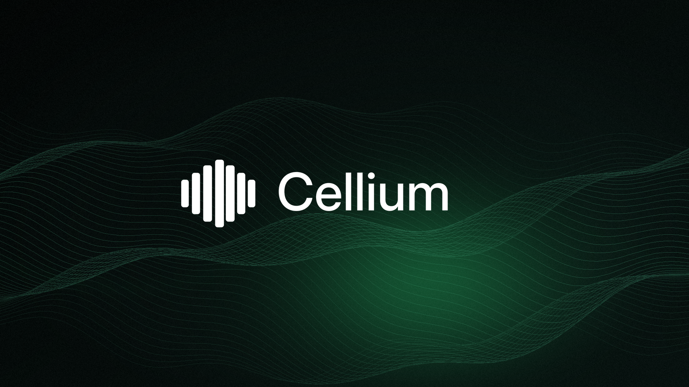

<div align="center">
  

  <h1>Cellium</h1>

  <p><strong>A local-first macOS battery observatory with history, alerts, learning and an evidence-aware AI assistant.</strong></p>

  <p>
    <a href="https://github.com/Obed0101/Cellium/releases/latest">Download the latest release</a>
    ·
    <a href="https://github.com/Obed0101/Cellium/actions/workflows/ci.yml">CI</a>
    ·
    <a href="LICENSE">MIT license</a>
  </p>
</div>

Cellium is a native macOS menu bar app for understanding what is happening to your Mac's battery and power system. It collects the signals macOS exposes, keeps history in local SQLite storage, explains patterns without pretending that estimates are measurements, and gives you an optional AI assistant grounded in the same evidence.

The current public release is **Cellium 0.1.10**.

## What Cellium answers

- **What is happening right now?** Battery level, active cells, charging state, power source, temperature, weather context, health and cycle count.
- **What changed over time?** Battery charge, power, temperature, CPU, memory, disk and process history across selectable time windows.
- **How quickly am I using battery cycles?** Battery Plan estimates equivalent full cycles (EFC), preserves measured hardware-counter changes and compares today's pace with your own history.
- **What is using the Mac?** Hourly Computer use estimates based on observed CPU and memory activity, plus process-level history and estimated battery impact.
- **Should I take action?** Deterministic alerts, local learning and optional macOS notifications surface conditions that have enough evidence to matter.
- **What does the AI know?** The optional assistant receives structured Cellium evidence, separates measured facts from estimates, keeps chat history locally and shows analysis logs with the prompt, response and local evidence.

## Showcase

These screenshots show the current Cellium interface, including the live dashboard, history, Computer use, alerts and AI surfaces.

<p align="center">
  
</p>

<p align="center"><sub>Live dashboard: current battery state, system context and historical signals in one glance.</sub></p>

<table align="center">
  <tr>
    <td align="center" width="50%">
      
      <br>
      <sub>Current state, health, power mode and 24-hour history</sub>
    </td>
    <td align="center" width="50%">
      
      <br>
      <sub>History, Computer use and weekly learning</sub>
    </td>
  </tr>
  <tr>
    <td align="center" width="50%">
      
      <br>
      <sub>Alerts and AI analysis history</sub>
    </td>
    <td align="center" width="50%">
      
      <br>
      <sub>Evidence-aware AI chat and analysis</sub>
    </td>
  </tr>
</table>

## Current capabilities

### Live battery dashboard

- Battery percentage and active-cell visualization.
- Charging state, power source, power draw and temperature.
- Battery health and cycle count shown as separate signals.
- Battery Plan card with unclamped daily EFC, measured cycle deltas, personal pace, weekly budget and confidence-aware forecasts.
- Thermal state, Low Power Mode, CPU, memory and disk status.
- Optional weather context with temperature, condition, humidity and wind.
- Clear “measured”, “calculated”, “estimated” and “no data” boundaries.

### Local history and trends

- SQLite-backed history for battery, power, temperature, system use and process samples.
- Selectable windows from **1 hour, 2 hours, 6 hours, 12 hours and 24 hours** through **3 days, 7 days, 14 days, 30 days, 90 days, 6 months, 1 year and all history**.
- Interactive charts with hover details for charge, power, temperature, CPU, memory and disk activity.
- Time windows keep their real resolution instead of silently collapsing everything into a misleading 24-hour average.
- Missing readings remain missing instead of being replaced with invented precision.
- Equivalent-use history uses 15-minute data for short windows and daily buckets for long windows, including hardware deltas, quality and observation gaps.

### Computer use and local learning

- Hourly Computer use timeline based on observed CPU and memory activity.
- Date navigation for reviewing previous Computer use days.
- Multi-day ranges render hourly activity across the selected period.
- Weekly learning shows observed charge, power and activity windows by day.
- Coverage and observed days remain visible so Cellium does not claim a routine before there is enough history.
- Process history groups applications, daemons, scripts and processes by average CPU, memory and estimated battery impact.

### Alerts and notifications

- Persistent alert history for battery, thermal, power and resource conditions.
- Proactive alerts with severity, measurements and a clear explanation of the trigger.
- Cycle-pace alerts distinguish elevated use from confirmed battery damage and prioritize critical `2 EFC / +2 cycles in 24h` signals.
- Alerts can be reviewed, grouped by day and cleared from the Alerts surface.
- Packaged app builds can request macOS notification permission and deliver proactive alerts through Notification Center.
- Notification behavior is opt-in through the system permission flow; direct SwiftPM development launches do not pretend to be a packaged notification-capable app.

### Optional AI assistant

The AI layer is available now as an opt-in feature. Normal monitoring does not require an AI provider.

- **Providers:** OpenRouter and local Ollama.
- **Models:** a built-in OpenRouter catalog with recommended, budget, fast, balanced and free options, plus custom model support.
- **Chat:** persistent local sessions, session titles, clear/new-session controls and battery-focused conversations.
- **Analysis:** manual analysis and optional automatic analysis, limited to one short request per hour when enabled and Wi-Fi is available.
- **Evidence:** structured battery, power, temperature, health, hardware-cycle, EFC pace, budget, system, process, weather and learning context.
- **Device and time context:** the Mac model identifier, macOS version, architecture, Cellium version, local date/time, timezone identifier, UTC offset, local hour, weekday and daylight-saving state are included when available.
- **Weather context:** the assistant can receive the weather location label, location timezone, condition, temperature, apparent temperature, humidity and wind. The weather location timezone is preferred; macOS's current timezone is the fallback.
- **Computer-use profile:** up to seven days of hourly CPU/memory aggregates are summarized as estimated active hours per day, typical start/end hours, peak hour and an hourly activity profile. This is an estimate of computer activity, not proof that a person was present.
- **Privacy:** process names are replaced with generic labels such as `application-1` or `process-2`; CPU, memory and estimated battery impact are retained. No extra IP-location lookup is performed by the AI context builder.
- **Analysis log:** prompt, response, provider, model, status, evidence and recommendations are visible in the Alerts surface and stored locally.
- **Response formatting:** AI responses render paragraphs, headings, lists, quotes and code as separate Markdown blocks while preserving inline formatting and escaped line breaks.
- **Safety:** the assistant must distinguish measured facts from estimates, acknowledge missing history, keep battery health separate from hardware cycles and EFC, and avoid diagnosing battery damage without supporting evidence.

### Local secrets and privacy controls

- OpenRouter API keys are encrypted locally in Application Support using Cellium's local installation secret store.
- Cellium does not use macOS Keychain for this installation secret flow.
- Credentials are not written to SQLite, the repository or plain `.env` files.
- AI, automatic analysis, weather, update checks and notifications are optional capabilities with explicit user-facing controls.

## Design principles

Cellium is intentionally local-first and evidence-driven:

- No account or cloud dashboard is required for normal monitoring.
- Read-only macOS adapters are used for system measurements.
- Cellium does not write to the SMC, install kernel extensions or require a privileged helper.
- Battery level, battery health, cycle count and estimated wear are not treated as interchangeable values.
- Exact per-process wattage is not claimed when macOS does not expose it. Process impact is labeled as an estimate.
- The interface shows when history is incomplete instead of presenting false certainty.

## How the data flows

```text
macOS power, system and process APIs
                 │
                 ▼
        CelliumDarwin read-only adapters
                 │ validated snapshots
                 ▼
             CelliumCore
                 │
        ┌────────┼─────────┐
        ▼        ▼         ▼
   CelliumStore  App   CelliumIntelligence
   local SQLite  UI    optional AI + chat
        │        │         │
        └────────┴─────────┘
          evidence, history and alerts
```

## Requirements

- macOS 14 or later.
- Apple Silicon is the currently validated development and distribution target.
- Xcode with the Swift 6 toolchain for development.
- An OpenRouter API key or a reachable Ollama endpoint is required only when the optional AI assistant is enabled.

Intel compatibility, exact per-process wattage, charge automation and Apple-notarized distribution are not promises of the current release.

## Install the latest release

Download the current DMG from [GitHub Releases](https://github.com/Obed0101/Cellium/releases/latest). The current artifact is `Cellium-0.1.10.dmg`.

The disk image contains `Cellium.app` and an `Applications` shortcut for drag-to-install. The free release is ad-hoc signed, not Apple-notarized, and macOS may require **System Settings → Privacy & Security → Open Anyway** on first launch. See [Documentation/DISTRIBUTION.md](Documentation/DISTRIBUTION.md) for Developer ID signing and notarization.

## Build and test locally

```bash
git clone https://github.com/Obed0101/Cellium.git
cd Cellium

# Run the package test suite.
swift test --parallel

# Build the menu bar app and CLI products.
swift build --product CelliumApp
swift build --product cellium
```

To run the app from Xcode, open `Cellium.xcodeproj` and run the `Cellium` scheme.

To create a local drag-to-Applications installer:

```bash
./Scripts/build-dmg.sh
open Distribution/Cellium-0.1.10.dmg
```

The distribution script validates the app bundle and DMG. It refuses to overwrite an existing disk image and supports Developer ID signing when configured. See [Documentation/DISTRIBUTION.md](Documentation/DISTRIBUTION.md).

## Repository layout

```text
App/                         Native menu bar app and SwiftUI surfaces
Packages/CelliumCore/        Models, sampling and validation
Packages/CelliumDarwin/      Read-only macOS power and system adapters
Packages/CelliumStore/       SQLite history, migrations and queries
Packages/CelliumIntelligence/AI contracts, providers, secrets and evidence
Packages/CelliumAutomation/  Explicit, allowlisted automation contracts
Tests/                       Core, Darwin, store and intelligence tests
Documentation/               Distribution, platform, security and showcase assets
Scripts/                     Local build and distribution helpers
```

## Privacy and security

Cellium is designed to operate without network access during normal battery monitoring. It does not require an account and does not collect window titles, document content, keyboard input, screenshots or full device serials. Optional provider, weather, update and notification capabilities are user-controlled.

Read [SECURITY.md](SECURITY.md) before reporting a vulnerability. Do not put credentials, private telemetry, database exports or signing material in an issue or pull request.

## Updates

Cellium can check the public GitHub Releases API once per day when automatic checks are enabled, or immediately when the user presses **Check now** in Settings. It compares semantic versions, opens the public release page when an update exists and never downloads or executes a remote binary automatically.

## Contributing

Contributions are welcome while the project is being shaped. Read [CONTRIBUTING.md](CONTRIBUTING.md), use the `dev` branch as the integration target, keep pull requests focused and run the test suite before opening a pull request.

Before changing a sensor or capability, check the [platform constraints](Documentation/PLATFORM_CONSTRAINTS.md), [sensor matrix](Documentation/SENSOR_MATRIX.md), [threat model](Documentation/THREAT_MODEL.md) and [branding policy](Documentation/BRANDING.md).

## Project status

The `main` branch is the stable public branch. Active development happens on `dev`. Cellium is intentionally conservative: a sensor or feature is not considered ready merely because a value can be read once on one Mac.

## License

Cellium is available under the [MIT License](LICENSE).
